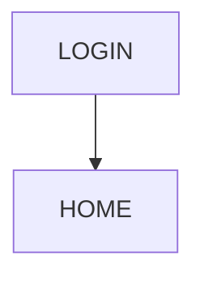

# UI Design Document Rules

- When creating a UI design document (`docs/details/ui.md`), always refer to the PRD (`docs/prd/prd.md`) and reflect requirements, objectives, and user experience.
- Write the UI design document in Markdown format and always include the following:
  1. Screen list (screen name, overview, usage scene)
  2. Details of each screen (layout, main UI elements, input fields, buttons, states, validation, error messages)
  3. Screen transition diagram (written in Markdown or Mermaid notation)
  4. User flow (main operation scenarios in bullet points)
  5. Accessibility and responsive design policy
  6. Insert wireframes or diagrams as needed
- Emphasize consistency, intuitiveness, accessibility, and mobile support in UI design.
- Each section of the UI design document must have headings and explanations in English.
- Example of a UI design document:

````markdown
# 画面設計書

## 画面一覧

| 画面 ID | 画面名       | 概要                       |
| ------- | ------------ | -------------------------- |
| LOGIN   | ログイン画面 | ユーザー認証を行う画面     |
| HOME    | ホーム画面   | メイン機能のダッシュボード |

## 各画面の詳細

### ログイン画面

- 概要: ユーザーがメールアドレスとパスワードでログインする画面
- UI 要素:
  - メールアドレス入力欄（バリデーション: Email 形式）
  - パスワード入力欄（バリデーション: 8 文字以上）
  - ログインボタン
  - エラーメッセージ表示領域
- 状態:
  - 入力中、バリデーションエラー、認証中、認証失敗
- アクセシビリティ:
  - ラベル付与、キーボード操作対応

### ホーム画面

- 概要: ユーザーの習慣一覧と進捗を表示
- UI 要素:
  - 習慣リスト
  - 進捗バー
  - 新規習慣追加ボタン

## 画面遷移図



## ユーザーフロー

- ユーザーの操作シナリオを記述する
  - ログイン画面でメールアドレスとパスワードを入力
  - ログインボタンをクリック
  - ホーム画面に遷移し、一覧を表示

## アクセシビリティ・レスポンシブ対応

- すべての UI 要素にラベルを付与し、キーボード操作・スクリーンリーダー対応を行う
- モバイル・PC 両対応のレイアウト設計
````
